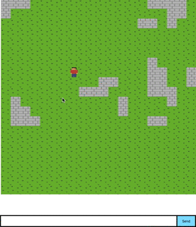

#Multiplayer Part 2 (#onegameaweek - Game 11)

Multiplayer movement example.  Shows remote user movements and basic chat.
Multiplayer communication handled by [firebase](http://firebase.com)

You can play the game [here](http://divideby5.com/games/mpp2).

##Tools
Developed using [Phaser.js](http://phaser.io)

###SFX

###Sprites

